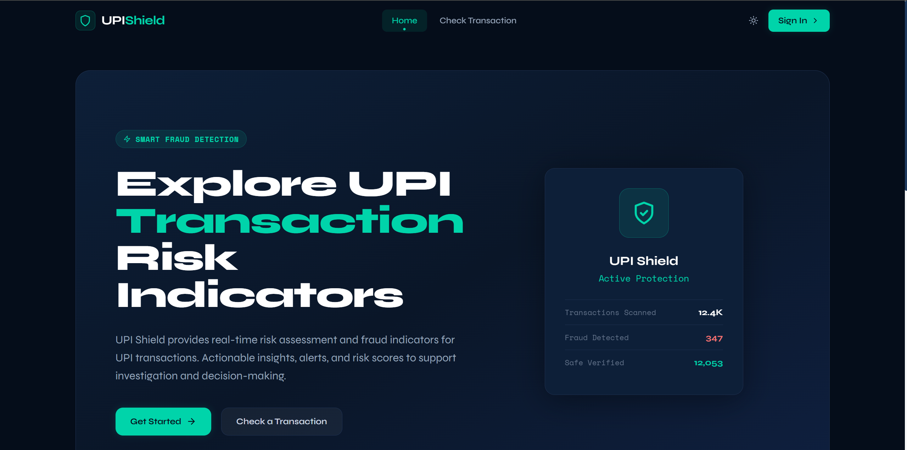
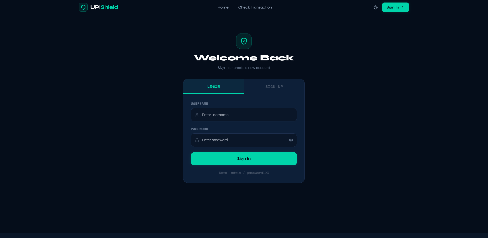
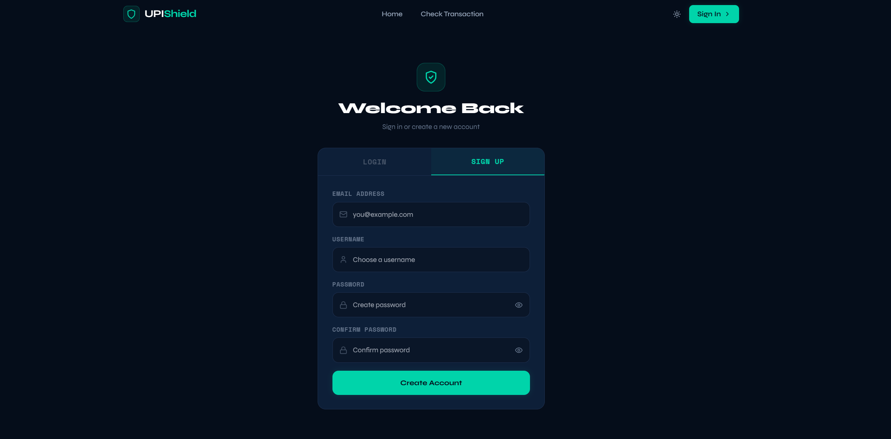
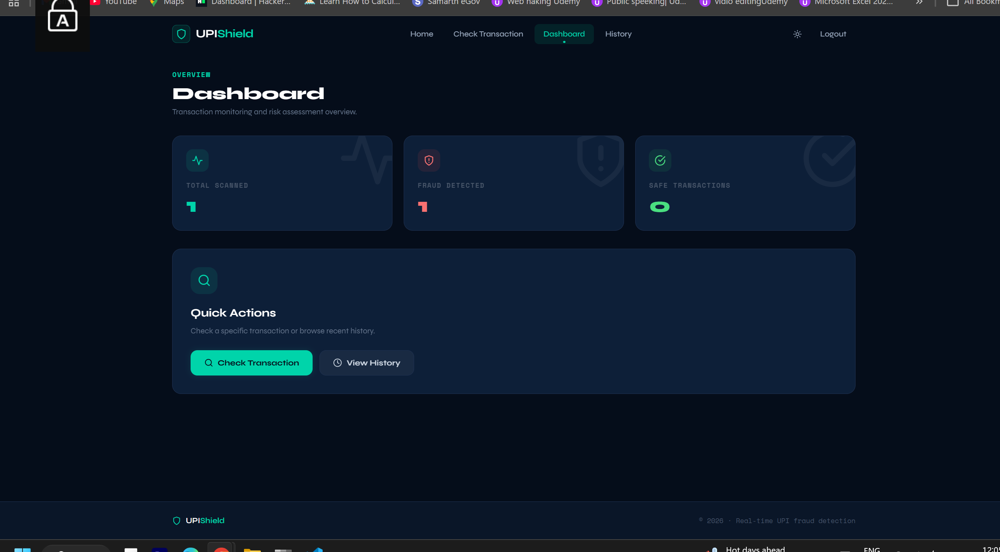
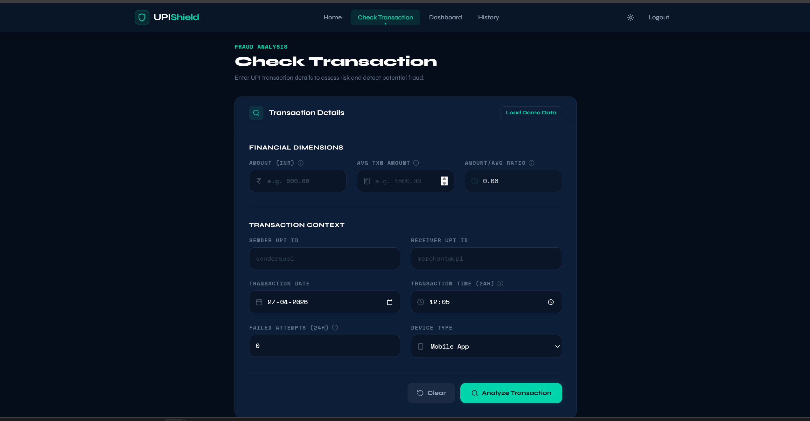
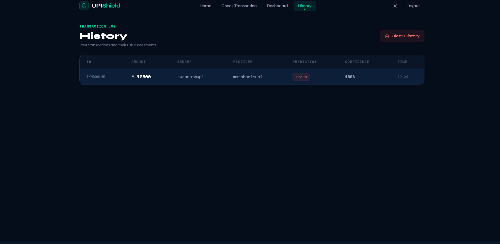
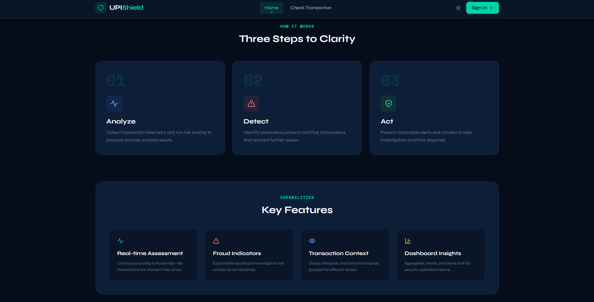

# 🛡️ UPI Fraud Detection System

A modern, full-stack application designed to detect and prevent fraudulent UPI transactions in real-time using Machine Learning. Built with the MERN stack and integrated with a high-performance Python-based ML engine.


---

## 🚀 Key Features

- **Real-time Fraud Prediction**: Instant analysis of UPI transactions using advanced ML models.
- **Secure Authentication**: JWT-based login and registration system with password encryption.
- **Dynamic Dashboard**: Visual overview of transaction statistics (Total, Fraud, Safe).
- **Transaction History**: Securely stored and manageable history of all past predictions.
- **Modern UI**: A premium, responsive glassmorphism interface built with React and Tailwind CSS.
- **Explainable Results**: Confidence scores for every prediction to assist in decision-making.

---

## 🛠️ Tech Stack

### Frontend
- **Framework**: React.js (Vite)
- **Styling**: Tailwind CSS
- **Icons**: Lucide React
- **Routing**: React Router DOM

### Backend
- **Server**: Node.js & Express.js
- **Database**: MongoDB (Mongoose)
- **Auth**: JWT (JSON Web Tokens) & Bcrypt.js
- **Bridge**: Python-Shell (Real-time Node-to-Python communication)

### ML Engine
- **Language**: Python 3.x
- **Libraries**: Scikit-Learn, TensorFlow, NumPy, Joblib
- **Logic**: Custom-trained model processing transaction features like amount, time, and failure history.

---

## 📂 Project Structure

```text
upi-fraud-detection/
├── Backend ML/           # Python ML logic & saved models
│   ├── predict.py        # Main prediction script
│   └── requirements.txt  # Python dependencies
├── upi_modern_v2/        # React Frontend (Vite)
│   ├── src/              # Dashboard, History, Login components
│   └── package.json
├── server.js             # Main Express API Server
├── package.json          # Node.js dependencies
└── README.md
```

---

## ⚙️ Setup & Installation

### Prerequisites
- Node.js (v16+)
- Python (v3.8+)
- MongoDB (Running locally on default port 27017)

### 1. Backend Setup (API & ML)
```bash
# Install Node dependencies
npm install

# Install Python dependencies
cd "Backend ML"
pip install -r requirements.txt
cd ..

# Start the API server
npm start
```
*The server will run on `http://localhost:5000`*

### 2. Frontend Setup
```bash
cd upi_modern_v2
npm install
npm run dev
```
*The UI will run on `http://localhost:5173`*

---

## 🔌 API Documentation

| Endpoint | Method | Description | Auth Required |
| :--- | :--- | :--- | :--- |
| `/api/auth/register` | `POST` | Create a new account | No |
| `/api/auth/login` | `POST` | Authenticate & get JWT | No |
| `/api/predict` | `POST` | Submit transaction for ML analysis | **Yes** |
| `/api/history` | `GET` | Fetch user's transaction history | **Yes** |
| `/api/dashboard/stats` | `GET` | Get total counts for dashboard cards | **Yes** |

---

## 🛡️ Security
- **Data Privacy**: Transactions are uniquely associated with user IDs in MongoDB.
- **Tokenization**: JWT ensures that only authenticated users can access the prediction engine and history.
- **Hashing**: User passwords are never stored in plain text (Bcrypt).

---

## 📸 Screenshots

### 🔹 Home Page


### 🔹 Login Page


### 🔹 Signup Page


### 🔹 User Dashboard


### 🔹 Transaction Check


### 🔹 User History


### 🔹 Working Flow



## 👨‍💻 Authors

- Naivyam Pandey  
- Pragati Dwivedi 
- Maneesh Maurya  
- Kriti Gaur

## 📝 License
This project is licensed under the ISC License.

---
*Developed with ❤️ for secure digital payments.*